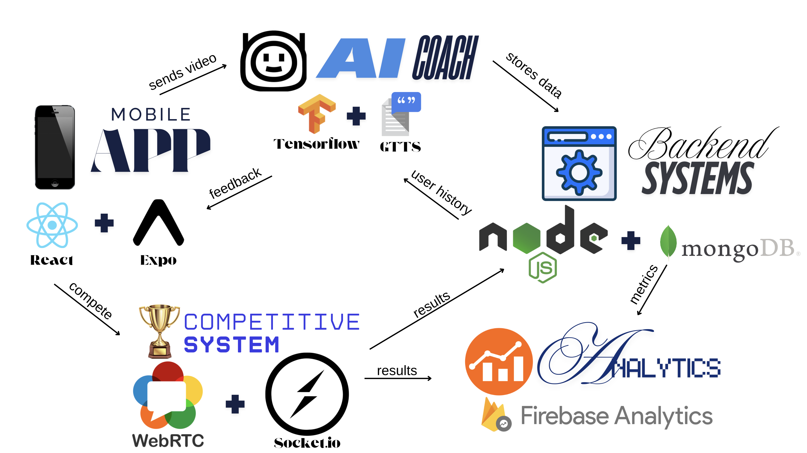

# GYM-MASTER 🏋️‍♂️

A cutting-edge fitness application that combines AI coaching, real-time form correction, and social competition to transform your workout experience.

## Architecture Overview 📊



Our application follows a modern, microservices architecture:

```
┌─────────────────┐      ┌─────────────────┐      ┌─────────────────┐
│                 │      │                 │      │                 │
│   Mobile App    │◄────►│    AI Coach     │◄────►│ Backend Services│
│React Native+Expo│      │ TensorFlow+GTTS │      | Node.js+MongoDB │
│                 │      │                 │      │                 │
└────────┬────────┘      └─────────────────┘      └────────-┬───────┘
         │                                                  │
         │                                                  │
         ▼                                                  ▼
┌─────────────────┐                               ┌─────────────────-┐
│                 │                               │                  │
│  Competition    │ ◄──────────────────────────►  │    Analytics     |
│     System      │                               │    Platform      │
│ WebRTC+Socket.io│                               │Firebase Analytics│
│                 │                               │                  │
└─────────────────┘                               └─────────────────-┘
```

## Features ✨

- 📱 **Mobile Application**: User-friendly interface with exercise tracking and gamification
- 🤖 **AI Coach**: Real-time pose estimation and form correction
- 🗣️ **Voice Coaching**: Audio feedback during workouts
- 🏆 **Competition System**: Challenge friends with dual-phone battles
- 📊 **Progress Tracking**: Comprehensive metrics and achievements
- 🔐 **User Authentication**: Secure account management
- 🏅 **Rewards System**: Gamified workout experience with achievements

## Technology Stack 💻

### Frontend
- React with React Router
- Bootstrap for responsive UI
- Axios for API communication
- Context API for state management

### Backend
- Node.js server with Express
- MongoDB database
- JWT authentication
- RESTful API architecture

### AI Components ( CURRENTLY )
- Flask for the API server
- MediaPipe for pose detection
- Scikit-learn (MLP) for push-up classification
- OpenCV for image processing

### Real-time Features (Coming Soon)
- WebRTC for video streaming
- Socket.io for real-time communication
- COMPETITIVE SYSTEM (Coming Soon)

### Analytics (Coming Soon MAYBE...) 
- Firebase Analytics

## Getting Started 🚀

### Prerequisites

- Node.js v14+ and npm
- MongoDB (local installation or MongoDB Atlas)
- Git
  
### Python FLASK API Setup

1. Navigate to push_ups root
```bash
cd ExcersiseDetection
```

2. Create Virtual Enviornment (if not already made)
```bash
python -m venv .venv
```

3. Activate Virtual Enviornment
```bash
source .venv/bin/activate # ON WINDOWS: .venv\Scripts\activate
```

3. Install Python dependencies
```bash
pip install -r requirements.txt
```

5. Start the Flask API Server
```bash
cd push_ups
python3 PushUps.py
```

### Backend Setup

1. Start New Termnial

2. Set up the backend
```bash
# Navigate to the backend directory
cd gym-master-backend

# Create virtual enviornmemt (for backend)
python -m venv myenv

# Activate virtual enviornment (for backend)
source myenv/bin/activate # ON WINDOWS: myvenv\Scripts\activate

# Install dependencies 
pip install -r requirements.txt

# Create .env file for configuration
echo 'PORT=5001
MONGODB_URI=mongodb+srv://gym-master:<ASK_FOR_PASSWORD>@gym-master.vjykr.mongodb.net/?appName=gym-master
JWT_SECRET=your_jwt_secret_key 
JWT_EXPIRE=30d' > .env # Duration 30 Days (JWT)
```

3. Start the backend server
```bash
# Start the server
node src/server.js

# You should see output indicating the server is running on port 5001
# and MongoDB is connected
```

### Frontend Setup

1. Open a new terminal window/tab

2. Set up the frontend
```bash
# Navigate to the frontend directory from the project root
cd gym-master-frontend

# Install dependencies
npm install
```

3. Start the frontend development server
```bash
# Start the development server
npm start

# This will open the application in your browser at http://localhost:3000
```

### Using the Application

1. Register a new account through the registration page
2. Log in with your credentials
3. Navigate through the application using the menu:
   - Dashboard: Overview of your fitness activity
   - Profile: Update your personal information
   - Progress: Track and add new workouts
   - Rewards: View achievements and badges

## API Documentation 📝

Our backend provides the following RESTful endpoints:

### Authentication
- `POST /api/auth/register` - Create a new user account
- `POST /api/auth/login` - Authenticate a user

### User Profiles
- `GET /api/users/profile` - Get user profile
- `PUT /api/users/profile` - Update user profile

### Progress Tracking
- `POST /api/progress` - Record a new workout
- `GET /api/progress` - Get workout history
- `GET /api/progress/:id` - Get specific workout details

### Rewards System
- `GET /api/rewards` - List all available rewards
- `GET /api/rewards/user` - Get user's earned rewards
- `POST /api/rewards/check` - Check for new earned rewards

## Troubleshooting 🔧

### Backend Issues
- If port 5001 is already in use, change the PORT in .env file
- Verify MongoDB is running locally or your connection string is correct
- Check server logs for specific error messages

### Frontend Issues
- Make sure the backend server is running before starting the frontend
- Check browser console for any error messages
- Verify the API base URL in `src/utils/api.js` matches your backend URL

## Contributing 👥

We welcome contributions to GYM-MASTER! Please follow these steps:

1. Fork the repository
2. Create a feature branch: `git checkout -b feature/amazing-feature`
3. Commit your changes: `git commit -m 'Add some amazing feature'`
4. Push to the branch: `git push origin feature/amazing-feature`
5. Open a Pull Request

## License 📄

This project is licensed under the MIT License - see the LICENSE file for details.

---

LETS GO JIM!
